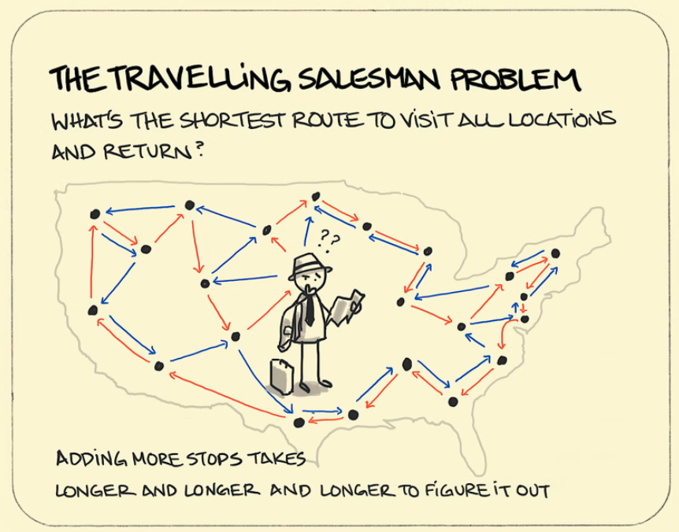

## Machine Learning Algorithms for The Travelling Salesman Problem

#### TSP PROBLEM

The traveling salesman problem (TSP), also known as the traveling salesperson problem or TSP is one of the most famous NP-complete problem in optimization. 

The problem statement is as following, “Given a list of cities and the distances between each pair of cities, what is the shortest possible route that visits each city exactly once and returns to the origin city?” TSP has been used intensely as a benchmark for evaluating optimization algorithms since the day it was proposed in the 1930s.



#### PROJECT DESCRIPTION

We proposed four ML algorithms (Branch-and-Bound, Nearest Neighbor, Genetic Algorithm, and Simulated Annealing) for solving the traditional TSP problem and evaluated their performances with empirical analysis.

#### TSP ALGORITHMS

- Branch-and-Bound: bnb.py
- Heuristics (Nearest Neighbor): approx.py
- Local Search I - Genetic Algorithm: LS1.py
- Local Search II - Simulated Annealing: LS2.py

#### CODE USAGE

- In the terminal, set your file path to the "code" folder.

- Run the following command (We can replace "python" with "python3" if "python" command is not found)

   ```shell
   python tsp_main.py -inst [data_path] -alg [BnB | Approx | LS1 | LS2] -time [int]
   ## or
   python tsp_main.py -inst [data_path] -alg [LS1 | LS2] -time [int] -seed [int]
   
   ## for example
   python tsp_main.py -inst ../DATA/Atlanta.tsp -alg Approx -time 600
   ```

- The outputs are generated under the "output" folder (next to the "code" folder).

#### OUTPUT FORMAT

- instance\_method\_cutoff\_[random_seed].sol
- instance\_method\_cutoff\_[random_seed].trace

.sol file includes the quality of best solution found and the list of vertex IDs of the TSP tour, while .trace file includes a timestamp in seconds and quality of the best found solution at that point in time.

#### REFERENCES

[1]	Website. 2021. Travelling salesman problem - Wikipedia. 2021. Retrieved 3 December 2021, from https://en.wikipedia.org/wiki/Travelling_salesman_problem. 

[2]	Mark de Berg et. al. 2018. An ETH-Tight Exact Algorithm for Euclidean TSP. eprint arXiv:1807.06933. 
[3]	Bellman R. 1962, Dynamic Programming Treatment of the Travelling Salesman Problem. J. Assoc. Comput. Mach., 9, 61–63.

[4]	Website. 2021. World Traveling Salesman Problem. (n.d.). Retrieved 3 December 2021, from http://www.math.uwaterloo.ca/tsp/world/.

[5]	Xiuwei Zhang. 2021. CSE6140/CX4140 Fall 2021 TSP Project.

[6]	Website. 2021. Simulated Annealing - Wikipedia. 2021. Retrieved 3 December 2021, from https://en.wikipedia.org/wiki/Simulated_annealing#cite_note-1. 

[7]	Kirkpatrick S., Gelatt Jr, C. D., Vecchi, M. P. 1983. Optimization by Simulated Annealing. Science. 220 (4598), 671–680.

[8]	L Ingber. 1996. Adaptive simulated annealing (ASA): Lessons learned. Control and Cybernetics. Vol. 25 No. 1, 33–54.

[9]	De Vicente Juan, Lanchares Juan, Hermida, Román. 2003. Placement by thermodynamic simulated annealing. Physics Letters A, 317 (5–6), 415–423.

[10]	Laarhoven, P. J. M. van (Peter J. M.) (1987). Simulated annealing : theory and applications. Aarts, E. H. L. (Emile H. L.). Dordrecht: D. Reidel. ISBN 90-277-2513-6. OCLC 15548651.

[11]	Frederick Hayes-Roth. 1975. Review of Adaptation in Natural and Artificial Systems by John H. Holland. The U. of Michigan Press, 1975. ACM SIGART Bulletin 53 (1975), 15–15.

[12]	Pedro Larranaga, Cindy M. H. Kuijpers, Roberto H. Murga, Inaki Inza, and Sejla Dizdarevic. 1999. Genetic algorithms for the travelling salesman problem: A review of representations and operators. Artificial intelligence review 13, 2 (1999), 129–170.

[13]	Göktürk Üçoluk. 2002. Genetic algorithm solution of the TSP avoiding special crossover and mutation. Intelligent Automation & Soft Computing 8, 3 (2002), 265–272.

[14]	Peter Merz and Bernd Freisleben. 1997. Genetic local search for the TSP: New results. In Proceedings of 1997 Ieee International Conference on Evolutionary Computation (Icec’97), IEEE, 159–164.

[15]	David E Goldberg, Bradley Korb, and Kalyanmoy Deb. 1989. Messy genetic algorithms: Motivation, analysis, and first results. Complex systems 3, 5 (1989), 493–530.

[16]	Vedat Toğan and Ayşe T Daloğlu. 2008. An improved genetic algorithm with initial population strategy and self-adaptive member grouping. Computers & Structures 86, 11–12 (2008), 1204–1218.

[17]	Andre, J., Siarry, P., & Dognon, T. (2001). An improvement of the standard genetic algorithm fighting premature convergence in continuous optimization. Advances in Engineering Software, 32(1), 49–60.

[18]	David E Goldberg, Robert Lingle, and others. 1985. Alleles, loci, and the traveling salesman problem. In Proceedings of an international conference on genetic algorithms and their applications, Carnegie-Mellon University Pittsburgh, PA, 154–159.

[19]	IM Oliver, DJd Smith, and John RC Holland. 1987. Study of permutation crossover operators on the traveling salesman problem. In Genetic algorithms and their applications: proceedings of the second International Conference on Genetic Algorithms: July 28-31, 1987 at the Massachusetts Institute of Technology, Cambridge, MA, Hillsdale, NJ: L. Erlhaum Associates, 1987.

[20]	Lawrence Davis and others. 1985. Applying adaptive algorithms to epistatic domains. In IJCAI, 162–164.

[21]	Zbigniew Michalewicz, Cezary Z Janikow, and Jacek B Krawczyk. 1992. A modified genetic algorithm for optimal control problems. Computers & Mathematics with Applications 23, 12 (1992), 83–94.

[22]	Michalewicz, Z., Janikow, C. Z., & Krawczyk, J. B. (1992). A modified genetic algorithm for optimal control problems. Computers & Mathematics with Applications, 23(12), 83–94.

[23]	Banzhaf, W. (1990). The “molecular” traveling salesman. Biological Cybernetics, 64(1), 7–14.

[24]	Syswerda, G. (1991). A study of reproduction in generational and steady-state genetic algorithms. In Foundations of genetic algorithms (Vol. 1, pp. 94–101). Elsevier.

[25]	G. Gutin, A. Yeo and A. Zverovitch, Exponential Neighborhoods and Domination Analysis for the TSP, in The Traveling Salesman Problem and Its Variations, G. Gutin and A.P. Punnen (eds.), Kluwer (2002) and Springer (2007).

[26]	G. Gutin, A. Yeo and A. Zverovich, Traveling salesman should not be greedy: domination analysis of greedy-type heuristics for the TSP. Discrete Applied Mathematics 117 (2002), 81–86.

[27]	J. Bang-Jensen, G. Gutin and A. Yeo, When the greedy algorithm fails. Discrete Optimization 1 (2004), 121–127.

[28]	G. Bendall and F. Margot, Greedy Type Resistance of Combinatorial Problems, Discrete Optimization 3 (2006), 288–298.

[29]	John D. C. Little, Katta G. Murty, Dura W. Sweeney, and Caroline Karel. 1963. An Algorithm for the Traveling Salesman Problem. Oper. Res. 11, 6 (December 1963), 972–989

[30]	R. Radharamanan, L.I. Choi, A branch and bound algorithm for the travelling salesman and the transportation routing problems, Computers & Industrial Engineering, Volume 11, Issues 1–4, 1986, Pages 236-240, ISSN 0360-8352

[31]	Donald L. Miller, Joseph F. Pekny, Exact Solution of Large Asymmetric Traveling Salesman Problems, Science 1991-02-15 251(4995): 754-761


